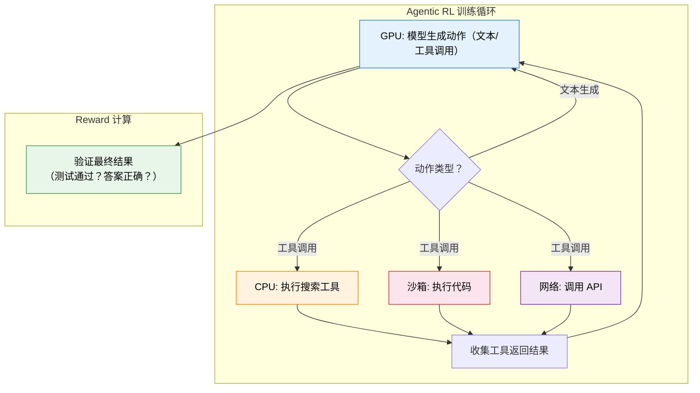
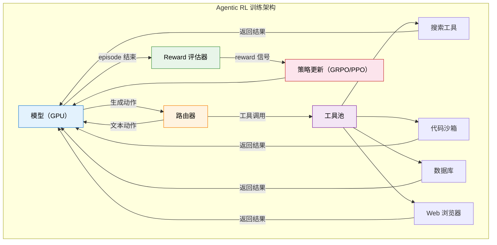
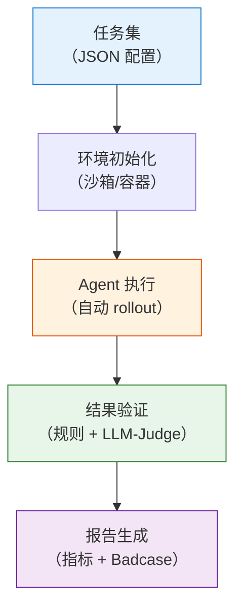

# 12.4 Agentic RL 工程实战与总结

前三节我们讲了多轮 RL 的信用分配、轨迹合成方法和工具调用的策略学习。现在我们要面对一个更"接地气"的问题：怎么把这些想法变成一个真正能跑起来的训练系统？Agentic RL 的工程复杂度远超标准 LLM RL——你不仅要管理 GPU 上的模型训练，还要管理 CPU 上的工具执行、网络上的环境交互、安全沙箱里的代码运行。这一节我们来拆解这些工程挑战，并总结整章的核心收获。

## 环境瓶颈：为什么 Agentic RL 跑不快

在标准的 LLM RL 训练中（如第 6 章的 PPO 或第 8 章的 GRPO），训练循环是纯 GPU 的：模型在 GPU 上生成回答，Reward Model 在 GPU 上打分，梯度在 GPU 上计算。整个过程中最慢的环节通常是 GPU 计算。

但 Agentic RL 的训练循环完全不同。模型每生成一个"工具调用"动作，就需要暂停等待工具执行的结果。这个执行过程发生在 GPU 之外：



这带来了三个核心瓶颈：

**安全性**。代码执行必须在沙箱中进行——模型可能生成"删除系统文件"或"读取环境变量"的恶意代码。Docker 容器是最常用的沙箱方案，但容器的创建和销毁有毫秒级的开销，在训练循环中累积起来就成了显著的瓶颈。

**可复现性**。RL 训练要求相同的输入产生相同的输出。但工具调用的结果可能是不确定的——搜索引擎对同一个 query 在不同时间可能返回不同结果，API 的响应时间可能波动。这导致同一条训练轨迹无法精确复现，增加了调试难度。

**延迟**。工具调用的响应时间从毫秒（本地代码执行）到秒级（网络 API 调用）不等。在标准 RL 训练中，GPU 的计算是连续的；但在 Agentic RL 中，GPU 经常在"等待"工具执行的结果，导致 GPU 利用率低下。

```python
import asyncio
import docker

class ToolSandbox:
    """安全的工具执行沙箱：用 Docker 容器隔离代码执行"""

    def __init__(self, image="python:3.11-slim", timeout=30):
        self.client = docker.from_client()
        self.image = image
        self.timeout = timeout

    async def execute(self, code: str) -> dict:
        """在沙箱中异步执行代码，返回结果和状态"""
        try:
            container = self.client.containers.run(
                self.image,
                command=f"python -c '{code}'",
                detach=True,
                mem_limit="512m",      # 内存限制
                cpu_period=100000,
                cpu_quota=50000,        # CPU 限制（50%）
                network_mode="none",    # 禁止网络访问
                remove=True,
            )
            result = container.wait(timeout=self.timeout)
            output = container.logs().decode("utf-8")
            return {"success": result["StatusCode"] == 0, "output": output}
        except Exception as e:
            return {"success": False, "output": str(e)}
```

## 基础设施对比：标准 LLM RL vs Agentic RL

理解了瓶颈之后，让我们对比一下两种 RL 训练基础设施的核心区别：

| 组件         | 标准 LLM RL              | Agentic RL                                    |
| ------------ | ------------------------ | --------------------------------------------- |
| Rollout 引擎 | GPU 生成文本             | GPU 生成文本 + **CPU 执行工具**（异构计算）   |
| 环境交互     | 无（纯文本生成）         | **需要工具沙箱、Web 环境、代码执行器**        |
| Reward 来源  | Reward Model 打分（GPU） | **环境执行结果**（代码通过/失败，可异步）     |
| Episode 长度 | 固定（生成 max_tokens）  | **可变**（不同任务需要不同轮数）              |
| 并行策略     | GPU 批量生成             | **异步并发**（多条轨迹同时等工具返回）        |
| 容错         | 生成失败重试             | **工具执行可能超时/崩溃**，需要 fallback 机制 |
| 可复现性     | 高（确定性生成）         | **低**（工具执行结果可能不确定）              |

这个对比揭示了一个关键洞察：**Agentic RL 的训练基础设施本质上是一个分布式系统**——它需要同时管理 GPU 计算、CPU 执行、网络通信、状态同步。这比标准 LLM RL 的"纯 GPU"训练复杂了一个数量级。

从形式化的角度来看，标准 LLM RL 的训练吞吐量主要受限于 GPU 计算时间：

$$\text{Throughput}_{\text{standard}} \propto \frac{1}{T_{\text{GPU}}}$$

而 Agentic RL 的训练吞吐量受限于 GPU 计算和工具执行的**最大值**：

$$\text{Throughput}_{\text{agentic}} \propto \frac{1}{\max(T_{\text{GPU}}, T_{\text{tool}})}$$

当工具执行时间远大于 GPU 计算时间时（$T_{\text{tool}} \gg T_{\text{GPU}}$），GPU 大部分时间在空等——这就是为什么异步并发（下面会讨论）是 Agentic RL 工程优化的关键。

## 代表性框架

### AWorld-RL：完整的 Agentic RL 环境

AWorld-RL 提供了一个完整的 Agentic RL 训练环境，包括多种工具（搜索、代码执行、数据库查询）、标准化的环境接口、以及配套的 RL 训练算法。它的设计理念是"把 Agentic RL 变得像 Gymnasium 一样易用"——你只需要定义任务和 reward，框架负责处理工具执行、沙箱管理、轨迹收集等工程细节。

### Agent-R1：端到端 Agentic RL 框架

Agent-R1（中科大出品）是 Agentic RL 领域的标杆开源项目。它对传统 MDP 进行了扩展，使其能更好地描述 LLM 智能体面临的复杂、动态环境。框架由 BaseTool（工具抽象）、BaseToolEnv（状态管理）和 ToolGenerationManager（多轮对话管理）等模块构成，高度解耦，易于扩展。它明确区分了过程奖励（Process Reward）和结果奖励（Outcome Reward），为解决长程任务中的稀疏奖励问题提供了有效手段。

### AReaL：全异步 RL 训练

AReaL（清华 & 蚂蚁出品）的核心创新是**全异步训练**——将 Actor rollout、工具执行和 Learner 更新彻底解耦，不同组件以不同速率并行运行。实验显示，全异步策略将训练速度提升了最高 2.77 倍，同时原生支持多轮 Agentic RL 训练。对于需要频繁与工具环境交互的 Agentic 场景，异步架构能显著提升 GPU 利用率。

### NeMo Gym：NVIDIA 的科学 Agent 训练平台

NeMo Gym 是 NVIDIA 推出的 Agentic RL 训练基础设施，专注于科学 Agent 的训练。它提供了化学分子模拟、药物发现等科学计算环境，支持高效的并行工具执行和分布式训练。

### Agentic RL Training Recipes

Agentic RL Training Recipes 是社区维护的开源训练方案集合，覆盖了从简单的工具调用 RL 到复杂的多轮 Agent RL 的多种训练方案。每个方案都包含完整的代码、配置和训练曲线。



## 异步并发：让 GPU 不再空等

前面提到 Agentic RL 最大的工程瓶颈是 GPU 等待工具执行。一个关键的工程优化是**异步并发**——同时启动多条轨迹的工具调用，让 GPU 在等待一组工具返回的同时处理另一组轨迹。

```python
import asyncio

async def rollout_single_trajectory(model, task, sandbox, max_turns=10):
    """单条轨迹的异步 rollout"""
    state = task.initial_state()
    turns = []

    for t in range(max_turns):
        # GPU: 模型生成动作
        action = await model.generate_async(state)
        turns.append(action)

        if action.is_final_answer():
            break

        # CPU/网络: 异步执行工具
        observation = await sandbox.execute_async(action)
        state = state.update(observation)

    return turns, task.evaluate(turns)

async def parallel_rollouts(model, tasks, sandbox, num_workers=16):
    """并行启动多条轨迹的 rollout，充分利用 GPU 和工具执行器"""
    coroutines = [
        rollout_single_trajectory(model, task, sandbox)
        for task in tasks
    ]
    # asyncio.gather 实现并发：一条轨迹在等工具返回时，其他轨迹可以使用 GPU
    results = await asyncio.gather(*coroutines)
    return results
```

这个设计的核心思想是：**GPU 生成和工具执行是两种不同类型的计算，它们可以流水线化**。当轨迹 A 的工具在 CPU 上执行时，GPU 可以同时为轨迹 B 生成动作。这就像餐厅的流水线——厨师（GPU）不需要等上一桌的菜上完才开始做下一桌的菜。

实际工程中，这种异步并发通常能把 GPU 利用率从 20-30% 提升到 70-80%，训练吞吐量提升 2-3 倍。但实现起来比听起来复杂得多——你需要处理超时、重试、状态同步等分布式系统的经典问题。

## 跨章节联系：Agentic RL 与前面章节的概念映射

Agentic RL 不是凭空出现的——它和前面章节学过的几乎所有概念都有联系。下面的表格帮你梳理这些联系：

| 概念          | 前面章节                        | Agentic RL 中的对应                     |
| ------------- | ------------------------------- | --------------------------------------- |
| 动作空间      | 只有"生成 token"（第 5-8 章）   | 扩展为"生成文本 + 调用工具"（异构动作） |
| Reward 来源   | RM 打分 / 偏好比较（第 6-7 章） | 环境执行结果（可验证，第 8 章 RLVR）    |
| 信用分配      | Token 级别（第 6 章 PPO）       | Turn 级别（跨多轮，ORM vs PRM）         |
| GRPO 组内比较 | 多条回答对比（第 8 章）         | 多条轨迹对比（同样适用）                |
| 经验回放      | DQN 的 Replay Buffer（第 4 章） | 工具调用轨迹的回放（需要环境可复现）    |
| 策略梯度定理  | REINFORCE（第 5 章）            | 多轮策略梯度（Turn-Level Discounting）  |
| Actor-Critic  | PPO（第 6 章）                  | Agentic PPO（Critic 评估轮次价值）      |
| RLVR          | 可验证奖励（第 8 章）           | 工具执行结果的天然可验证性              |

值得注意的是，经验回放在 Agentic RL 中的使用比在标准 DQN 中更加微妙。DQN 的经验回放可以直接复用旧数据，因为环境是确定的（CartPole 的物理规律不变）。但 Agentic RL 中，工具的执行结果可能随时间变化（搜索引擎的结果会更新），所以旧轨迹可能不再有效。这意味着 Agentic RL 的经验回放需要**过期机制**——超过一定时间或者环境状态发生变化的旧轨迹应该被丢弃。

## 评估基准：怎么知道你的 Agent 行不行？

前面讨论的都是"怎么训练"。但训练完之后，你怎么知道你的 Agent 到底好不好？Agentic RL 的评估比标准 LLM 评估复杂得多——不只是"回答对不对"，而是"在一个复杂的多步任务中，Agent 是否选择了正确的工具、走了正确的路径、高效地完成了任务"。

### 核心评估维度

Agentic RL 的评估可以从三个维度来理解：

| 维度     | 评估什么                  | 代表性基准                   |
| -------- | ------------------------- | ---------------------------- |
| 工具调用 | 模型能否正确调用 API/工具 | BFCL、ACEBench、API-Bank     |
| 任务完成 | Agent 能否完成端到端任务  | SWE-bench、WebArena、τ-bench |
| 综合能力 | 通用智能助手水平          | GAIA、Toolathlon             |

### 工具调用排行榜

**BFCL（Berkeley Function Calling Leaderboard）** 是目前业界最权威的工具调用排行榜，由 UC Berkeley 的 Gorilla 团队维护。它评估模型在各种场景下正确调用函数的能力——简单函数、多函数组合、RESTful API、 Java 函数等。BFCL v3 包含 2,000+ 测试用例，覆盖从单工具到多工具、从简单参数到嵌套对象的各类场景。排行榜地址：[gorilla.cs.berkeley.edu/leaderboard.html](https://gorilla.cs.berkeley.edu/leaderboard.html)。

**ACEBench** 从更细的粒度评估工具使用能力，将评测分为 Normal（基础调用）、Special（高级场景如并行调用、长上下文）和 Agent（多智能体协作）三个类别。ACEBench 被 ACL 2025 收录，是目前最全面的工具使用评测之一。

**API-Bank** 提供了 53 个常用 API 工具和 314 个工具使用对话，侧重评估 API 规划、检索和调用的完整能力链。

### 端到端任务基准

**SWE-bench** 评估的是代码智能体解决真实 GitHub Issue 的能力——给定一个开源项目的 Issue 描述，Agent 需要理解代码库、定位问题、编写修复补丁。这是目前最难的代码 Agent 评测之一，顶级模型（如 Claude Opus）的解决率也仅在 50% 左右。排行榜地址：[swebench.com](https://www.swebench.com/)。

**WebArena** 提供了一个真实的 Web 环境让 Agent 执行任务——在电商网站购物、在论坛发帖、在 GitLab 上管理代码仓库。Agent 需要理解网页的视觉布局和 DOM 结构，执行点击、输入、导航等操作。这比 BFCL 的"调用一个函数"要难得多——Agent 需要在真实、动态的 Web 环境中行动。

**τ-bench（tau-bench）** 评估对话式智能体与用户协作完成领域任务的能力。它模拟了航空订票、电商客服等真实场景，Agent 需要引导用户提供信息、查询数据库、执行操作。核心挑战是 Agent 需要在多轮对话中维护状态、处理用户的不确定输入。

### 综合能力基准

**GAIA（General AI Assistants Benchmark）** 是目前最具挑战性的通用 AI 助手评测之一，包含 450 个需要推理、多模态理解、工具使用、Web 搜索等多种能力的问题。GAIA 分为三个难度等级，即使是顶级模型在最高难度上的表现也远未饱和。排行榜地址：[HuggingFace GAIA Leaderboard](https://huggingface.co/spaces/gaia-benchmark/leaderboard)。

**Toolathlon** 专注于多工具、长时间工作流的评测，包含 108 个手选的复杂任务，每个任务平均需要与 20+ 个工具交互。它评估的不只是"能不能用工具"，而是"能不能编排复杂的工作流"。

### 怎么选基准？

```
你要评估什么？                    推荐基准
├─ 基础函数调用能力               → BFCL
├─ 多场景工具使用                 → ACEBench
├─ 代码修复能力                   → SWE-bench
├─ Web 操作能力                   → WebArena
├─ 多轮对话协作                   → τ-bench
└─ 综合智能助手水平               → GAIA / Toolathlon
```

一个务实的建议：**从 BFCL 开始**。它最容易上手，评测成本最低（不需要沙箱环境），可以快速验证你的 Agent 的基础工具调用能力。等基础能力达标后，再用 SWE-bench 或 WebArena 评估端到端的任务完成能力。

## Agent 评测系统设计

上面列出了"用什么基准评测"。但工业界面临的更实际的问题是：**怎么搭一个评测系统**？特别是当你的 Agent 在快速迭代时，你需要一个自动化、可复现、能回归检测的评测平台。

### 评测 Pipeline 架构

一个完整的 Agent 评测 Pipeline 包含五个环节：



```python
# ==========================================
# Agent 评测 Pipeline（简化版）
# ==========================================

class AgentEvaluationPipeline:
    """Agent 评测流水线"""

    def __init__(self, sandbox, judge_model):
        self.sandbox = sandbox      # Docker 沙箱
        self.judge = judge_model    # LLM-as-Judge

    def run_evaluation(self, agent, task_set):
        """运行完整评测"""
        results = []

        for task in task_set:
            # 1. 初始化环境（每个任务独立的沙箱）
            env = self.sandbox.create_isolated_env(task.get("setup", {}))

            # 2. Agent 执行任务
            trajectory = agent.run(task["prompt"], env, max_turns=task.get("max_turns", 20))

            # 3. 结果验证
            if task.get("verify_type") == "exact_match":
                passed = trajectory.final_answer.strip() == task["expected_answer"].strip()
            elif task.get("verify_type") == "execution":
                # 代码类任务：在沙箱中执行验证脚本
                passed = env.execute(task["verify_script"], trajectory.final_answer)
            elif task.get("verify_type") == "llm_judge":
                # 主观类任务：用 LLM 评估
                passed = self.judge.evaluate(task["prompt"], trajectory.final_answer, task["rubric"])
            else:
                passed = False

            results.append({
                "task_id": task["id"],
                "passed": passed,
                "turns": trajectory.num_turns,
                "tool_calls": trajectory.tool_calls,
                "final_answer": trajectory.final_answer
            })

        return results

    def regression_test(self, agent, baseline_results, task_set):
        """回归测试：新模型不能退步旧能力"""
        new_results = self.run_evaluation(agent, task_set)

        regressions = []
        for old, new in zip(baseline_results, new_results):
            if old["passed"] and not new["passed"]:
                regressions.append({
                    "task_id": old["task_id"],
                    "old_answer": old["final_answer"],
                    "new_answer": new["final_answer"]
                })

        if regressions:
            print(f"⚠️ 发现 {len(regressions)} 处能力退化！")
        return regressions
```

### 自动化复测框架

**确定性任务**（代码执行、API 调用、数学计算）可以直接用规则验证——答案对不对、代码能不能跑、API 调用参数对不对。这些评测是完全自动化的，不需要人工介入。

**非确定性任务**（开放式问答、创意生成、多轮对话）需要用 LLM-as-Judge 评估。关键是设计好评分标准（Rubric），让 Judge 的评估可复现：

```python
RUBRIC_TEMPLATE = """
评估标准（每项 1-5 分）：

1. 准确性：回答中的事实是否正确？是否有幻觉？
2. 完整性：是否完整回答了用户的问题？有无遗漏？
3. 引用质量：如果有引用，是否真实可访问？是否支持论断？
4. 效率：是否用了合理的步骤数完成任务？有无冗余操作？

总分 = 各项加权平均
"""
```

### 评测驱动训练改进

评测不只是"打分"，更重要的是**把评测结果反馈到训练循环**中。完整的闭环是：

```
评测 → Badcase 分析 → 定向数据合成 → 再训练 → 再评测
```

具体来说：

1. **收集失败案例**：评测中未通过的任务
2. **归因分析**：是工具调用错了？还是推理逻辑错了？还是信息不够？
3. **定向合成**：针对失败类型生成训练数据（参考[12.2 节轨迹合成](./trajectory-synthesis)）
4. **训练改进**：用新数据做一轮 GRPO/PPO 训练
5. **回归验证**：确保新模型在修复问题的同时没有退步旧能力

这个闭环和[附录 B 的评测体系](/appendix_industrial_training/evaluation-badcase)是一脉相承的，只是从 LLM 评测扩展到了 Agent 评测。Agent 评测的特殊之处在于需要管理沙箱环境和工具执行状态，这使得 Pipeline 的实现复杂度更高。

## 本章总结

让我们回顾第 12 章的核心收获：

**1. Agentic RL = 多轮 RL + 工具调用。** 从"生成文本"扩展到"在环境中行动"，这是从对话模型到自主智能体的关键跨越。

**2. 信用分配是核心难题。** 7 轮交互失败了，该怪谁？ORM 只看结果（简单但信号稀疏），PRM 每步都评（密集但标注昂贵）。在实践中，两者的组合（如 MLMT-RL 的多粒度奖励）效果最好。

**3. RLVR 是 Agentic RL 的天然选择。** 工具执行结果是客观可验证的——代码是否通过测试、SQL 查询结果是否正确——不需要训练额外的 Reward Model。

**4. 环境是工程瓶颈。** 安全沙箱、可复现性、低延迟——这些工程问题直接决定了 Agentic RL 能否从论文走向生产。

<details>
<summary>思考题：如果你要训练一个"能独立完成软件项目"的 Code Agent，你会怎么设计 RL 训练方案？</summary>

这是一个开放性问题，没有标准答案，但有几个关键考量：

**Reward 设计**：不能只看"最终代码是否通过测试"。一个好的 Code Agent 还需要：代码可读性（是否写了注释？命名是否清晰？）、架构合理性（是否合理地拆分了模块？）、鲁棒性（是否处理了边界情况？）。这些可以用多维度 reward 来建模。

**信用分配**：一个软件项目可能需要几十轮交互。纯 ORM 在这里会非常困难——信号太稀疏。PRM 或某种"里程碑式 reward"（比如"完成了数据库设计"是一个中间里程碑）可能更合适。

**课程学习**：不能一开始就让它做完整项目。从单函数 → 单文件 → 多文件 → 完整项目，逐步增加任务难度。

**安全约束**：代码执行沙箱是必须的，但还需要防止模型学会"走捷径"——比如通过硬编码测试用例来通过测试（而不是真正解决问题）。

</details>

到这里，我们已经覆盖了 Agentic RL 的核心理论和工程实践。下一节，我们来看看工业界各家的 Agentic RL 实战经验——[工业界实战：各家的 Agentic RL 都怎么做的？](./industrial-practice)，拆解 LinkedIn、Bespoke Labs、Moonshot、Alibaba 通义、Salesforce、Amazon 六家公司的训练方案、踩坑记录和关键取舍。

## 参考资料

- Cheng M, Zhang H, et al. "[Agent-R1: Training Powerful LLM Agents with End-to-End Reinforcement Learning](https://arxiv.org/abs/2511.14460)." arXiv:2511.14460, 2025. —— Agentic RL 标杆框架，扩展 MDP 建模并区分过程奖励和结果奖励。[GitHub](https://github.com/AgentR1/Agent-R1)
- AReaL Team. "[AReaL: Async RL for Language Reasoning](https://arxiv.org/abs/2505.24298)." arXiv:2505.24298, 2025. —— 清华 & 蚂蚁出品的异步 RL 框架，全异步训练提升速度 2.77 倍。[GitHub](https://github.com/inclusionAI/AReaL)
- NVIDIA. "[NeMo Gym](https://github.com/NVIDIA-NeMo/Gym)." —— NVIDIA 的科学 Agent 训练平台。
- Patil S, et al. "[The Berkeley Function Calling Leaderboard](https://gorilla.cs.berkeley.edu/leaderboard.html)." 2023. —— BFCL 排行榜，评估 LLM 函数调用能力。
- Jimenez C E, et al. "[SWE-bench: Can Language Models Resolve Real-World GitHub Issues?](https://arxiv.org/abs/2310.06770)." ICLR 2024. —— 代码智能体评估基准。
- Zhou S, et al. "[WebArena: A Realistic Web Environment for Building Autonomous Agents](https://arxiv.org/abs/2307.13854)." ICLR 2024. —— Web Agent 评估环境。
- Mialon G, Fourrier C, Wolf T, et al. "[GAIA: A Benchmark for General AI Assistants](https://arxiv.org/abs/2311.12983)." NeurIPS 2023. —— 通用 AI 助手评测。
- Ma L, et al. "[ACEBench: Who Wins the Match Point in Tool Usage?](https://arxiv.org/abs/2501.12851)." ACL 2025. —— 综合工具使用评测。
- Sierra Team. "[τ-bench: A Benchmark for Tool-Agent-User Interaction in Real-World Domains](https://arxiv.org/abs/2406.12045)." arXiv:2406.12045, 2024. —— 对话式智能体评测。
- Li M, et al. "[API-Bank: A Comprehensive Benchmark for Tool-Augmented LLMs](https://arxiv.org/abs/2304.08244)." EMNLP 2023. —— 工具增强 LLM 评测。
- Qin Y, et al. "[ToolLLM: Facilitating Large Language Models to Master 16000+ Real-world APIs](https://arxiv.org/abs/2307.16789)." ICLR 2024. —— ToolBench 工具学习平台。
- Ji H, et al. "[The Tool Decathlon](https://arxiv.org/abs/2510.25726)." arXiv:2510.25726, 2024. —— Toolathlon，多工具长时间工作流评测。
- Zhu J, Sang H, et al. "[Unlocking Agentic RL Training for GPT-OSS: A Practical Retrospective](https://huggingface.co/blog/LinkedIn/gpt-oss-agentic-rl)." Hugging Face Blog, 2026. —— LinkedIn 团队在 GPT-OSS MoE 模型上的 Agentic RL 调试实践，包含 attention sink backward 实现。
- Zhuang R, Vu T, et al. "[Improving Multi-Turn Tool Use with Reinforcement Learning](https://www.bespokelabs.ai/blog/improving-multi-turn-tool-use-with-reinforcement-learning)." Bespoke Labs Blog, 2025. —— GRPO 训练多轮工具调用的详细踩坑记录和稳定性 recipe。
- Moonshot AI. "[Kimi-Researcher: End-to-End RL Training for Emerging Agentic Capabilities](https://moonshotai.github.io/Kimi-Researcher/)." 2025. —— 端到端 REINFORCE 训练自主研究智能体，包含 partial rollout 和 context management 机制。
- Tongyi DeepResearch Team. "[Tongyi DeepResearch: From Chatbot to Autonomous Agent](https://tongyi-agent.github.io/blog/introducing-tongyi-deep-research/)." 2025. —— 三阶段 Agentic CPT → SFT → RL 管线，30B MoE 模型的 Deep Research Agent。[GitHub](https://github.com/Alibaba-NLP/DeepResearch)
- Salesforce AI Research. "[Building Efficient RL Training for the Agentic Era](https://www.salesforce.com/blog/efficient-rl-training-agentic-era/)." 2026. —— SFR-RL 的流水线同步架构和 MoE Expert Parallelism 优化。
- Subramanian S, Xu P, Wang Y. "[Customizing Multiturn AI Agents with Reinforcement Learning](https://www.amazon.science/blog/customizing-multiturn-ai-agents-with-reinforcement-learning)." Amazon Science Blog, 2026. —— 小数据（72 题）RL 定制 Agent 的实践，证明数据质量 > 数量。
