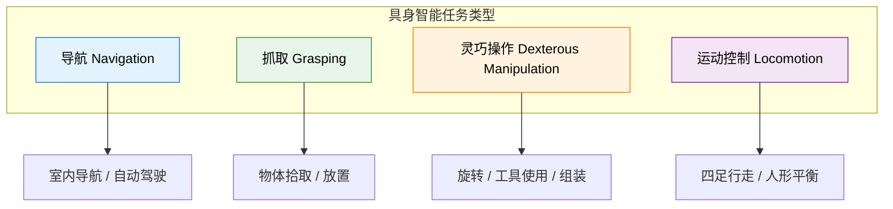
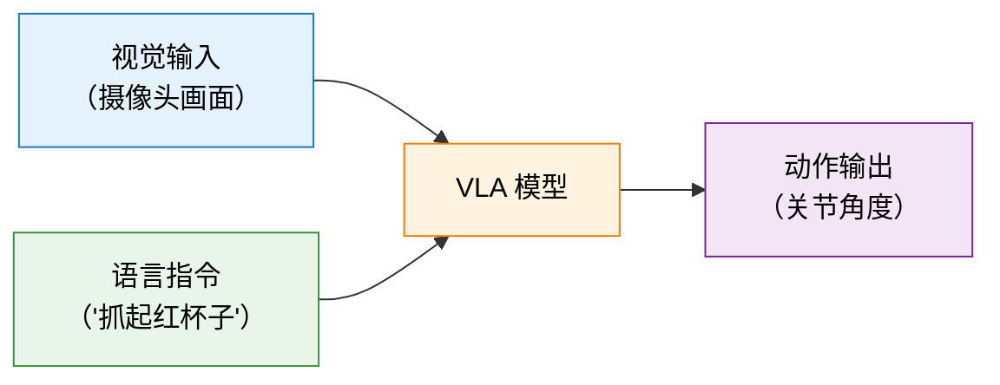

# 12.1 具身智能——让 RL 走进物理世界

前面八章，我们的智能体一直活在"数字世界"里——CartPole 的倒立摆、Atari 的像素、LLM 的 token。这些场景有一个共同特征：试错几乎零成本，`env.reset()` 毫秒级完成，环境完全可控。但 RL 的终极目标远不止于此——我们希望智能体能走进真实世界，操控机器人、驾驶汽车、在工厂和医院里完成复杂任务。

这就是**具身智能（Embodied Intelligence）**要解决的问题：让 AI 拥有"身体"，在物理世界中感知、决策和行动。

## 什么是具身智能？

具身智能是指**智能体通过物理身体与环境交互，在感知-决策-行动的闭环中完成任务的 AI 系统**。它不是纯粹在数字空间中处理数据的"离身智能"，而是强调智能必须通过身体与真实世界的交互来产生和体现。

这个概念来自认知科学的一个基本洞察：人类的智能不是在真空里"思考"出来的，而是在与物理世界的持续交互中塑造的。婴儿通过抓握、爬行、碰撞来理解物理规律，这种"身体经验"是认知发展的基础。具身智能把这个思想搬到了 AI 领域——让 AI 也通过"身体经验"来学习。


<div style="text-align: center; font-size: 0.9em; color: var(--vp-c-text-2); margin-top: -10px; margin-bottom: 20px;">
  <em>图 1：The Stanford arm，世界上第一台全电动并由计算机控制的机械臂，开启了机器人在物理世界中执行复杂操作的先河。来源：<a href="https://commons.wikimedia.org/wiki/File:The_Stanford_Arm.jpg" target="_blank" rel="noopener noreferrer">Wikimedia Commons</a></em>
</div>

### 核心特征

具身智能系统有三个核心特征：

1. **具身性**：智能体拥有物理或仿真的身体，能对环境施加力、移动物体、改变世界状态
2. **感知-行动闭环**：智能体的感知影响行动，行动改变环境，环境变化又反馈到感知——形成闭环
3. **物理约束**：动作受物理定律约束（重力、摩擦、碰撞），试错有成本，失败有后果

## 具身智能与普通 RL 的区别

你可能已经发现，具身智能用的也是 RL 的框架——状态、动作、奖励、策略。那它和前面学的 CartPole、PPO 训练 LLM 有什么本质区别？

| 维度       | 普通 RL（CartPole、LLM） | 具身智能 RL                        |
| ---------- | ------------------------ | ---------------------------------- |
| 动作空间   | 离散为主（左/右、token） | 连续高维（关节角度、力矩、速度）   |
| 状态空间   | 低维向量或 token 序列    | 多模态（视觉+力觉+本体感觉+语言）  |
| 环境动力学 | 快速模拟，可瞬时重置     | 物理仿真昂贵，真实环境几乎无法重置 |
| 试错成本   | 几乎为零                 | 高（时间、设备损耗、安全风险）     |
| 泛化要求   | 固定环境即可             | 必须适应多变物理条件               |
| 样本效率   | 可以大量试错             | 必须高效利用每一次交互             |

核心差异可以归结为一点：**在普通 RL 中，你不需要关心"动作如何改变物理世界"；在具身智能中，这是所有问题的起点。**

## 具身智能主流任务类型

具身智能的任务五花八门，但按智能体与环境的交互方式，可以归为几大类：

### 导航（Navigation）

智能体在环境中移动到目标位置。比如机器人从客厅走到厨房，自动驾驶汽车从 A 点到 B 点。状态通常是视觉观测（摄像头画面），动作是移动速度和转向角。

### 抓取（Grasping）

机械臂从桌上抓取指定物体。这是机器人操作中最基础的任务，也是最具挑战性的任务之一——因为抓取涉及精确的力控制和接触建模。

### 灵巧操作（Dexterous Manipulation）

比抓取更复杂的操作——旋转物体、双手协调、使用工具。比如让机器人学会用手指旋转一个方块，或者用锤子钉钉子。这类任务的自由度极高，动作空间维度动辄 20+。


<div style="text-align: center; font-size: 0.9em; color: var(--vp-c-text-2); margin-top: -10px; margin-bottom: 20px;">
  <em>图 2：配备高级抓取手的 PR2 机器人，常被用于研究灵巧操作和人机交互。来源：<a href="https://commons.wikimedia.org/wiki/File:PR2_robot_with_advanced_grasping_hands.JPG" target="_blank" rel="noopener noreferrer">Wikimedia Commons</a></em>
</div>

### 四足 / 人形行走（Locomotion）

让四足机器人学会在各种地形上行走、奔跑、跳跃，或者让人形机器人保持平衡并移动。波士顿动力的 [Atlas](https://bostondynamics.com/atlas/)、特斯拉的 [Optimus](https://www.tesla.com/AI) 都属于这类任务。


<div style="text-align: center; font-size: 0.9em; color: var(--vp-c-text-2); margin-top: -10px; margin-bottom: 20px;">
  <em>图 3：波士顿动力的 BigDog 四足机器人，能够在复杂地形中保持动态平衡和行走。来源：<a href="https://commons.wikimedia.org/wiki/File:Big_dog_military_robots.jpg" target="_blank" rel="noopener noreferrer">Wikimedia Commons</a></em>
</div>



## 从数学与代码看：具身智能与传统 RL 的区别

我们在前面的章节（如 CartPole 或雅达利游戏）中学过的强化学习，和在具身智能（如机械狗、机械臂）上跑的 RL 到底有什么区别？我们可以从数学建模和代码实现两个维度来对比：

### 1. 从 MDP 到 POMDP（部分可观测性）

- **传统 RL**：通常假设环境是完全可观测的马尔可夫决策过程（MDP）。比如倒立摆的状态 $S = [x, \dot{x}, \theta, \dot{\theta}]$ 只有 4 维，包含了环境的全部信息。
- **具身智能**：物理世界是**部分可观测马尔可夫决策过程（POMDP）**。机器人无法直接获取“世界的所有状态”，只能通过传感器（如摄像头、关节编码器、IMU）得到**观测（Observation）** $O_t$。
  - **数学上**：策略不再是 $\pi(a_t | s_t)$，而是依赖于历史观测序列 $\pi(a_t | O_1, A_1, ..., O_t)$。通常需要用 RNN/LSTM 或是多帧观测堆叠（Frame Stacking）来恢复速度等隐含信息。
  - **代码上**：观测空间从简单的 `Box(4,)` 变成了高维字典，例如 `Dict({'image': Box(3, 224, 224), 'proprioception': Box(12,)})`。

### 2. 动作空间：从低维离散到高维连续

- **传统 RL**：雅达利游戏的动作是离散的（上下左右），$a_t \in \{0, 1, ..., N\}$，策略网络最后一层通常是 Softmax 输出各类动作的概率。
- **具身智能**：真实机器人的关节电机需要连续的电压、扭矩或目标角度输入，$a_t \in \mathbb{R}^D$（例如 12 自由度机器狗的动作是 12 维连续向量）。
  - **数学上**：连续控制不能用 Softmax 穷举，通常假设动作服从多维高斯分布 $a_t \sim \mathcal{N}(\mu(s_t), \Sigma)$，神经网络输出的是均值 $\mu$ 和方差 $\Sigma$。
  - **代码上**：在 Gymnasium 中，动作空间从 `Discrete(4)` 变成了高维连续空间 `Box(low=-1.0, high=1.0, shape=(12,), dtype=np.float32)`。

### 3. 环境动态与 Sim-to-Real 鸿沟

- **传统 RL**：训练环境和测试环境的动态转移概率 $\mathcal{P}(s_{t+1}|s_t, a_t)$ 完全一致。
- **具身智能**：直接在真机上试错成本太高且容易损坏机器，必须在仿真（Simulation）中训练。但仿真引擎的动力学 $\mathcal{P}_{sim}$ 和物理世界 $\mathcal{P}_{real}$ 存在偏差（如摩擦力、电机延迟）。
  - **数学上**：我们不再仅仅是最大化单个 MDP 下的期望回报，而是引入**域随机化（Domain Randomization）**。将环境参数 $\mu$ 看作一个分布 $p(\mu)$，目标变为最大化分布下的平均表现：$\max_\pi \mathbb{E}_{\mu \sim p(\mu)} [\mathbb{E}_{\tau \sim \mathcal{P}_\mu}[R(\tau)]]$。
  - **代码上**：你会在环境的 `reset()` 或 `step()` 中看到大量的参数随机化注入：
    ```python
    def reset(self):
        # 每次重置环境时，随机改变机器人的质量和地面的摩擦力
        self.model.body_mass[:] *= np.random.uniform(0.8, 1.2)
        self.model.geom_friction[:] *= np.random.uniform(0.5, 1.5)
        return super().reset()
    ```

## 具身智能强化学习主流范式

具身智能的 RL 训练不是从头发明新算法，而是在我们前面学过的算法中选择最合适的，并针对物理世界的特点做适配。

### 在线策略：PPO——具身最常用

[PPO](https://arxiv.org/abs/1707.06347) 是具身智能中**使用最广泛的 RL 算法**。原因很简单：

- **稳定性**：PPO 的裁剪机制（clipping）天然适合连续动作空间，不会像 Vanilla PG 那样容易策略崩溃
- **可扩展性**：PPO 可以高效地在大量并行仿真器上训练，这在具身智能中至关重要
- **数据利用率**：相比 SAC 等离线策略算法，PPO 的数据利用效率略低，但训练吞吐量更高

在 [NVIDIA Isaac Gym](https://developer.nvidia.com/isaac-gym) 上，PPO 被用来同时训练数千个机器人——正是它在大规模并行采样上的优势让它成为具身 RL 的默认选择。OpenAI 的机械手解魔方（[Solving Rubik's Cube with a Robot Hand](https://openai.com/index/solving-rubiks-cube/)）、四足机器人 [ANYmal](https://www.anybotics.com/) 的地形行走，都是 PPO 的代表性应用。

### 离线策略：SAC 的定位

[SAC](https://arxiv.org/abs/1801.01290)（Soft Actor-Critic）在具身智能中扮演"精细调优"的角色。它的最大熵框架（Maximum Entropy）鼓励策略探索——这对灵巧操作等需要多样性行为的任务特别有价值。

SAC 的优势在于**样本效率**——它通过经验回放反复利用历史数据，每一步交互的数据都能被多次学习。在真实机器人上训练时（不是仿真），样本效率至关重要，因为真实交互的成本太高。

实践中，具身 RL 的典型范式是：**先用 PPO 在大规模仿真中预训练，再用 SAC 在真实机器人上微调**——利用 SAC 的样本效率来最小化真实世界的交互次数。

## 具身智能常用仿真环境


<div style="text-align: center; font-size: 0.9em; color: var(--vp-c-text-2); margin-top: -10px; margin-bottom: 20px;">
  <em>图 4：仿真环境中的机器人控制测试。高质量的物理仿真引擎是训练具身智能体不可或缺的基础设施。来源：<a href="https://commons.wikimedia.org/wiki/File:5R_robot.gif" target="_blank" rel="noopener noreferrer">Wikimedia Commons</a></em>
</div>

仿真环境是具身 RL 的基础设施——没有高质量的仿真器，具身智能就只能在真实机器人上试错，成本不可接受。以下是目前工业界和研究中最常用的几个仿真器：

### MuJoCo


<div style="text-align: center; font-size: 0.9em; color: var(--vp-c-text-2); margin-top: -10px; margin-bottom: 20px;">
  <em>图 5：机器人关节与动力学仿真示例。像 MuJoCo 这样的物理引擎能够提供精确的接触建模和运动学计算。来源：<a href="https://commons.wikimedia.org/wiki/File:SpaceRoboticsChallenge_Task2.png" target="_blank" rel="noopener noreferrer">Wikimedia Commons</a></em>
</div>

[MuJoCo](https://mujoco.org/)（Multi-Joint dynamics with Contact）是机器人仿真领域的"老牌标准"。它的核心优势是**接触动力学建模精确、仿真速度快**。MuJoCo 能精确模拟刚体之间的碰撞和接触力——这对抓取、行走等任务至关重要。DeepMind 的 [dm_control](https://github.com/google-deepmind/dm_control) suite 和 OpenAI Gym 的连续控制环境都基于 MuJoCo。2021 年 MuJoCo 被 DeepMind 收购并开源，目前免费可用。

### Isaac Gym / Isaac Sim


<div style="text-align: center; font-size: 0.9em; color: var(--vp-c-text-2); margin-top: -10px; margin-bottom: 20px;">
  <em>图 6：多机器人并行仿真框架示意。Isaac Gym/Sim 系列通过 GPU 并行能力，实现了大规模多机器人的同时训练。来源：<a href="https://commons.wikimedia.org/wiki/File:Asynchronous_Multi-Body_Framework,_AMBF.png" target="_blank" rel="noopener noreferrer">Wikimedia Commons</a></em>
</div>

NVIDIA 的 Isaac 系列是**GPU 并行机器人仿真**的代表。Isaac Gym（已 deprecated，继任者为 Isaac Lab/Isaac Sim）能在单块 GPU 上并行仿真数千个机器人环境，训练速度比 MuJoCo 快一到两个数量级。

::: info Isaac Lab 替代 Isaac Gym
NVIDIA 的 Isaac Gym 已被标记为 deprecated，其继任者 **Isaac Lab** 是目前 GPU 并行机器人仿真的标准工具。Isaac Lab 基于 Isaac Sim 构建，支持万级机器人同时训练，同时兼容 Gymnasium 接口。安装方式：`pip install isaacsim[all]`，详见 [Isaac Lab GitHub](https://github.com/isaac-sim/IsaacLab)。
:::

Isaac 系列的核心价值是**把仿真从 CPU 瓶颈解放出来**。PPO + Isaac Gym 的组合，让原本需要几天的训练缩短到几十分钟。

### ManiSkill / Sapien


<div style="text-align: center; font-size: 0.9em; color: var(--vp-c-text-2); margin-top: -10px; margin-bottom: 20px;">
  <em>图 7：使用机器人手臂进行抓取和操作（Manipulation）任务的仿真场景。这是 ManiSkill 和 Sapien 等仿真器最擅长的领域。来源：<a href="https://commons.wikimedia.org/wiki/File:Robotic_simulation_using_Robcad_software.jpg" target="_blank" rel="noopener noreferrer">Wikimedia Commons</a></em>
</div>

[ManiSkill](https://maniskill.readthedocs.io/)（基于 [Sapien](https://sapien.ucsd.edu/) 仿真器）是专注**机器人操作（Manipulation）**的仿真基准。它提供了一系列标准化的操作任务——从简单的推物体到复杂的多步骤组装——以及统一的评测接口。如果你做的是抓取、放置、组装类任务，ManiSkill 是目前最成熟的 benchmark。

| 仿真器                | 核心优势                     | 最适合的场景                  |
| --------------------- | ---------------------------- | ----------------------------- |
| MuJoCo                | 接触建模精确，物理可信度高   | 精细控制、学术研究基准        |
| Isaac Lab / Isaac Sim | GPU 并行，万级环境同时训练   | 大规模策略训练、四足/人形行走 |
| ManiSkill / Sapien    | 操作任务标准化，评测体系完善 | 抓取、放置、组装类任务        |

## Sim-to-Real：仿真到现实迁移核心思想


<div style="text-align: center; font-size: 0.9em; color: var(--vp-c-text-2); margin-top: -10px; margin-bottom: 20px;">
  <em>图 8：仿真与现实环境的对比。Sim-to-Real 的核心挑战在于跨越物理世界与数字世界之间的差异（Sim-to-Real Gap）。来源：<a href="https://commons.wikimedia.org/wiki/File:Xenobot_sim_to_real.png" target="_blank" rel="noopener noreferrer">Wikimedia Commons</a></em>
</div>

在仿真器中训练好策略后，下一步是迁移到真实机器人。这个过程叫做 **Sim-to-Real（从仿真到现实）**，是具身智能最关键也最困难的环节。

为什么不能直接把仿真策略部署到真实机器人？因为**仿真和现实之间存在差距（Sim-to-Real Gap）**：

- **物理差距**：模拟器中的摩擦力、重力、碰撞都是理想化的，真实世界的物理要复杂得多
- **感知差距**：模拟器提供精确的状态信息（关节角度、物体位置），真实机器人只能通过摄像头和力传感器来估计
- **动力学差距**：模拟器中的电机响应是即时的，真实电机有延迟和非线性

### 域随机化（Domain Randomization）

解决 Sim-to-Real Gap 最常用的技术。核心思想极其简单：**在训练时大量随机化仿真参数**——摩擦力在 0.3-0.7 之间随机、物体颜色随机、光照条件随机、传感器噪声随机。这样训练出来的策略不再依赖于特定的物理参数，而是学会了在各种条件下都能工作。

```python
def domain_randomized_env(base_params):
    """域随机化：在训练时随机化物理参数"""
    randomized = {}
    randomized["friction"] = np.random.uniform(0.3, 0.7)
    randomized["gravity"] = base_params["gravity"] * np.random.uniform(0.9, 1.1)
    randomized["joint_damping"] = np.random.uniform(0.01, 0.1)
    randomized["object_mass"] = base_params["mass"] * np.random.uniform(0.8, 1.2)
    return randomized
```

直觉上，这就像一个篮球运动员在训练时故意用不同气压的球、不同摩擦力的地板来练习——这样到了正式比赛，无论条件如何都能适应。

### 系统辨识（System Identification）

另一种思路是**让仿真更接近真实**：先用真实机器人的数据来估计物理参数（摩擦系数、关节阻尼等），然后在这些"校准过"的参数上训练策略。这比域随机化更精确，但也更耗时。

实践中两者常常结合使用：域随机化作为基础策略覆盖不确定性，系统辨识缩小需要随机的范围。

## 具身智能前沿

### 扩散策略（Diffusion Policy）

我们在第 7 章学过 PPO 的确定性策略输出——给定状态，网络输出一个动作向量。但很多操作任务的动作分布是多模态的：同一个目标，可能有多种有效的抓取方式。

扩散策略（[Diffusion Policy](https://diffusion-policy.cs.columbia.edu/)）把动作生成建模为一个**去噪扩散过程**——从随机噪声开始，逐步去噪生成最终动作。这和图像扩散模型的思路完全一致，只是生成对象从"图像"变成了"动作序列"。扩散策略天然支持多模态动作分布，在灵巧操作任务上表现优异。

### 视觉-语言-动作模型（VLA）


<div style="text-align: center; font-size: 0.9em; color: var(--vp-c-text-2); margin-top: -10px; margin-bottom: 20px;">
  <em>图 9：具备视觉感知和抓取能力的机器人系统。VLA 模型通过结合视觉输入和自然语言指令，直接生成机器人的物理动作，是实现通用具身智能的关键技术。来源：<a href="https://commons.wikimedia.org/wiki/File:Care-O-Bot_grasping_an_object_on_the_table_(5117071459).jpg" target="_blank" rel="noopener noreferrer">Wikimedia Commons</a></em>
</div>

VLA（Vision-Language-Action）是具身智能最新、最令人兴奋的方向。它把视觉理解、语言指令理解和动作生成统一到一个模型中。

典型流程：机器人收到指令"把桌子上的红色杯子拿起来"→ VLA 模型接收摄像头画面 + 语言指令 → 直接输出机器人的关节控制指令。

Google 的 [RT-2](https://robotics-transformer2.github.io/)（Robotic Transformer 2）是 VLA 的代表性工作：它用一个预训练的视觉语言模型，把机器人控制任务转化为"视觉问答"问题——输入图像和语言指令，输出动作 token。这和我们第 11 章 VLM RL 的思路一脉相承——只是输出从"文本回答"变成了"物理动作"。



VLA 的核心意义在于：它把具身智能从"针对特定任务训练特定策略"推进到了"通用策略理解语言指令并执行"——这是走向通用具身智能的关键一步。

## 动手实战：用 PPO 训练一个仿真机器人奔跑

为了让你直观体验具身智能的训练过程，我们这里提供一个**计算资源消耗极小**的实战代码。你只需要一台普通的笔记本电脑（无需 GPU，仅用 CPU），在几分钟内就能训练出一个能够向前奔跑的虚拟机器人（HalfCheetah）。

我们将使用前文提到的 `MuJoCo` 物理仿真引擎（目前已开源并集成在 Gymnasium 中），以及 `Stable-Baselines3` 库中的 `PPO` 算法。

### 1. 环境与机器人来源

首先，确保你的环境中安装了以下依赖：

```bash
pip install gymnasium[mujoco] stable-baselines3
```


<div style="text-align: center; font-size: 0.9em; color: var(--vp-c-text-2); margin-top: -10px; margin-bottom: 20px;">
  <em>图 10：Gymnasium 中的 HalfCheetah 机器人模型。你将使用 PPO 算法训练它从随机乱动到学会平稳向前奔跑。</em>
</div>

> **这个半猎豹（HalfCheetah）机器人从哪来的？**
> 它其实是 `gymnasium[mujoco]` 库中自带的经典连续控制基准测试模型（Benchmark Model）。你不需要自己画 3D 模型、设计关节或写物理计算代码，MuJoCo 环境已经内置好了这个由多个刚体（如躯干、大腿、小腿、脚）和旋转关节连接而成的生物力学模型。

### 2. 训练代码

创建一个名为 `train_cheetah.py` 的文件并运行以下代码。这段代码展示了经典的**仿真训练 → 渲染测试**的 Sim-to-Real 雏形（尽管这里只到了 Sim 阶段）：

```python
import gymnasium as gym
from stable_baselines3 import PPO

# ==========================================
# 第一阶段：在不可见（无渲染）的仿真中极速训练
# ==========================================
# 1. 创建 MuJoCo 仿真环境（半猎豹机器人，状态连续，动作连续）
# - 状态(Observation)：各关节的角度、角速度等（17 维）
# - 动作(Action)：施加在 6 个马达上的扭矩（6 维连续值）
# - 奖励(Reward)：向前的速度越快奖励越高，消耗能量或摔倒会扣分
env = gym.make("HalfCheetah-v4")

# 2. 初始化 PPO 智能体
# MlpPolicy 表示使用多层感知机作为策略网络
# verbose=1 会在终端打印训练进度（解释的方差、损失等）
model = PPO("MlpPolicy", env, verbose=1)

print("🚀 开始在 MuJoCo 仿真中训练 PPO...")
# 3. 开始训练
# HalfCheetah 相对比较好训练。在普通笔记本 CPU 上：
# - 跑 20万步（约 2~3 分钟）：机器人能学会手脚并用地向前蹭或跌跌撞撞地走。
# - 跑 100万步（约 10 分钟）：机器人能学会非常平稳、协调的奔跑姿势。
model.learn(total_timesteps=200_000)

# 4. 保存训练好的"大脑"
model.save("ppo_halfcheetah")
env.close()
print("✅ 训练完成，模型已保存！")

# ==========================================
# 第二阶段：加载"大脑"并进行可视化测试
# ==========================================
# 重新创建一个带可视化界面的环境 (render_mode="human")
eval_env = gym.make("HalfCheetah-v4", render_mode="human")
model = PPO.load("ppo_halfcheetah")

obs, info = eval_env.reset()

print("👀 开始渲染机器人的表现...")
for _ in range(1000):
    # 智能体根据当前状态输出动作（deterministic=True 表示不进行探索，直接输出最优动作）
    action, _states = model.predict(obs, deterministic=True)

    # 仿真环境物理引擎计算动作影响，返回下一帧画面、状态和奖励
    obs, reward, terminated, truncated, info = eval_env.step(action)

    if terminated or truncated:
        obs, info = eval_env.reset()

eval_env.close()
```

### 3. 你会看到什么？

1. **终端输出**：你会看到 PPO 在打印 `ep_rew_mean`（平均回合奖励）。你会发现这个数值从负数或者很小的正数，随着时间步（timesteps）的增加稳步上升。
2. **可视化窗口**：训练完成后，会弹出一个 MuJoCo 渲染窗口。你会看到一个两足的"半猎豹"机器人在物理世界中拼命向前奔跑，这就是 RL 纯靠**试错**和**奖励反馈**学习到的物理控制策略。

这就是具身智能最底层的逻辑：**物理仿真器提供交互反馈，RL 算法（如 PPO）优化控制策略网络。**

## 与前面章节的联系

| 前面章节的概念                    | 在具身智能中的对应                           |
| --------------------------------- | -------------------------------------------- |
| PPO 的稳定性与并行采样（第 7 章） | 具身 RL 最常用的训练算法，支持大规模并行仿真 |
| Actor-Critic 架构（第 6 章）      | SAC 的基础，用于真实机器人上的高效微调       |
| VLM RL 的多模态融合（第 11 章）   | VLA 模型：视觉 + 语言 → 动作                 |
| 策略梯度定理（第 5 章）           | 连续动作空间策略优化的数学基础               |
| RLHF 的奖励建模（第 8 章）        | 人类偏好反馈用于对齐机器人行为               |

<details>
<summary>思考题：为什么 PPO 比 SAC 更常用于具身智能的大规模仿真训练？</summary>

核心原因是**训练吞吐量**。在大规模并行仿真（如 Isaac Lab）中，你可以在 GPU 上同时跑数千个环境。PPO 的在线策略特性意味着每一批数据用完就可以扔掉——不需要维护经验回放缓冲区，内存效率极高。

SAC 的离线策略框架虽然样本效率更高，但它需要一个大的经验回放缓冲区（replay buffer），在数千个并行环境同时产生的数据面前，缓冲区的内存开销和采样开销会成为瓶颈。

简单说：**PPO 牺牲了单样本利用率，换来了更高的整体训练吞吐量**——在大规模仿真中，这个权衡是划算的。

</details>

## 延伸阅读与参考资料：宇树科技（Unitree）开源项目

如果想在物理世界中真正部署一个能跑能跳的机器人，国内机器人公司宇树科技（Unitree Robotics）提供了非常完善的强化学习开源生态。你可以参考以下资料，将我们在仿真中训练大脑的思路，应用到真实的四足或人形机器人上：

- **官方强化学习 Gym 仓库**：[unitreerobotics/unitree_rl_gym](https://github.com/unitreerobotics/unitree_rl_gym)
  这是一个基于 Isaac Gym 的四足/人形机器人 RL 控制仓库，支持 Go2、H1、G1 等型号。包含了如何训练、如何在 Isaac Gym 中进行可视化测试（Play），以及如何通过 Sim-to-Real 部署到真实机器人的全套代码。
- **开源运动控制框架**：[unitreerobotics/unitree_guide](https://github.com/unitreerobotics/unitree_guide)
  如果你不仅想了解强化学习（RL），还想了解传统的模型预测控制（MPC），这个仓库包含了传统控制算法和强化学习算法的对比与部署。
- **具身智能开发者社区指南**：开发者可以在 [宇树科技支持文档](https://support.unitree.com/home/zh/developer) 中找到针对不同机器人的强化学习例程复现指南，包含详细的环境配置、神经网络搭建（基于 `rsl_rl`）和模型导出。
